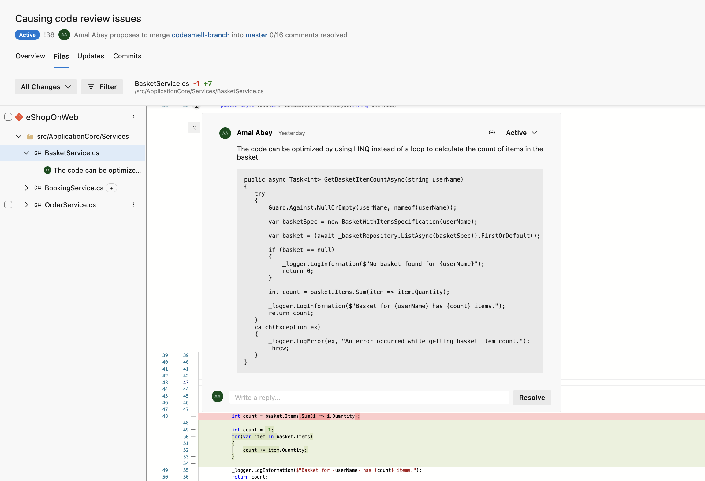

# bug-buster-bot
Latest development in Large Language Models (LLMs) such as OpenAI GPT have open the doors to leverage their capability to review and find bugs in code changes. bug-buster-bot is a tool that can be integrated with the developer workflow (via CI/CD pipelines) to automatically provide feedback on code changes using the underlying LLM APIs (e.g. OpenAI). The tool can automatically decorate Pull Requests with comments and code suggestions relevant to the changed code blocks.



## How does it work?
bug-buster-bot uses the APIs provided by the source control provider (currently only Azure Repos is supported) to retrieve code changes. It then uses OpenAI LLM to obtain the set of methods/functions changed and should be reviewed. Once it knows the semantic change set, it uses OpenAI LLM again to obtain code review suggestions for each method/function. The tool then, decorates the Pull Request files using the corresponding APIs. bug-buster-bot uses [langchain](https://github.com/hwchase17/langchain) to work with LLMs.

# Getting Started
The tool is currently under development and only developer instructions are available yet. Follow the steps below to setup your environment to be able to run, debug and develop the tool.

1. Obtain an API key to use OpenAI services from [here](https://platform.openai.com/account/api-keys).
2. Create a Personal Access Token(PAT) to allow the tool access your Azure DevOps repository as per the instructions [here](https://learn.microsoft.com/en-us/azure/devops/organizations/accounts/use-personal-access-tokens-to-authenticate?view=azure-devops&tabs=Windows). The PAT should have permissions to be able to write to Pull Requests.
3. Duplicate the `.env` file to `.env.local` and set your OpenAI API key and the PAT in the corresponding variables.
4. Create a Python [Virtual Environment](https://docs.python.org/3/library/venv.html) using below:
   ```
   virtualenv venv
   ```
5. Install all dependencies:
   ```
   pip install -r requirements.txt
   ``` 
6. Run the tool:
   ```
   python -m app -o <your-azure-devops-org-name> -p <project-name> -i <pull request id>
   ```

## LIMITATIONS
- Not yet available as a installable CLI tool that can be used in the pipelines
- Tool is not idemportant and creates duplicate comments on multiple runs on the same PR
- Often outputs false positives and requires tunning
- No test coverage yet
- Supports only Azure DevOps